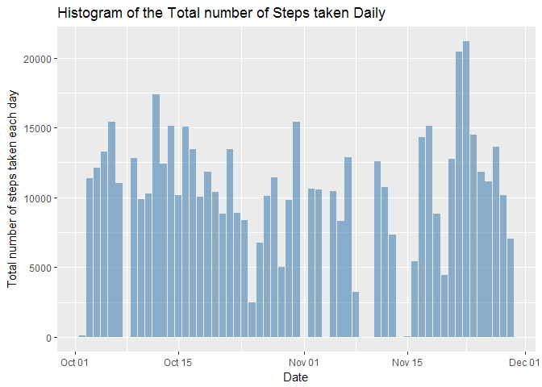

# Reproducible Research: Peer Assessment 1


# Reproducible Research - Week 2

This report is part of the assignment of the Reproducible Research course, part of the specialization for Data Science on Coursera. The course is proposed by the University John Hopkins.

## Objective and Instructions

### Introduction

It is now possible to collect a large amount of data about personal movement using activity monitoring devices such as a Fitbit, Nike Fuelband, or Jawbone Up. These type of devices are part of the quantified self movement a group of enthusiasts who take measurements about themselves regularly to improve their health, to find patterns in their behavior, or because they are tech geeks. But these data remain under-utilized both because the raw data are hard to obtain and there is a lack of statistical methods and software for processing and interpreting the data.

This assignment makes use of data from a personal activity monitoring device.

### Dataset for the assignment

This device collects data at 5 minute intervals through out the day. The data consists of two months of data from an anonymous individual collected during the months of October and November, 2012 and include the number of steps taken in 5 minute intervals each day.

The data for this assignment can be downloaded from the course web site:

[Dataset](https://d396qusza40orc.cloudfront.net/repdata%2Fdata%2Factivity.zip)

It will come in a zip format. After unzip, the dataset is available in .csv format.

The variables included in this dataset are:

- **steps**: Number of steps taking in a 5-minute interval (missing values are coded as NA)
- **date**: The date on which the measurement was taken in YYYY-MM-DD format
- **interval**: Identifier for the 5-minute interval in which measurement was taken

The dataset is stored in a comma-separated-value (CSV) file and there are a total of 17,568 observations in this dataset.

### Outlook of the report

1. Data loading, exploratory work and preprocessing
2. Computation 1 - Mean total number of steps per day
3. Computation 2 - Average daily activity pattern
4. Data processing, dealing with missing values
5. Analysis of the difference between weekdays and weekends

## Data loading, exploratory work and preprocessing

*For convenience, the dataset has alsready been downloaded and unzip. You can refer to the R_script DL_data.R for more information.*

*The report also assume that the dataset is available in your current working directory. Use setwd() function to set the appropriate directory.*

The following code loads the data and output a brief summary of the dataset.


```r
df <- read.csv("activity.csv")
head(df)
```

```
##   steps       date interval
## 1    NA 2012-10-01        0
## 2    NA 2012-10-01        5
## 3    NA 2012-10-01       10
## 4    NA 2012-10-01       15
## 5    NA 2012-10-01       20
## 6    NA 2012-10-01       25
```

```r
tail(df)
```

```
##       steps       date interval
## 17563    NA 2012-11-30     2330
## 17564    NA 2012-11-30     2335
## 17565    NA 2012-11-30     2340
## 17566    NA 2012-11-30     2345
## 17567    NA 2012-11-30     2350
## 17568    NA 2012-11-30     2355
```
We can see that there are a lot of missing data. The summary() function helps to see the scale of it. 

```r
summary(df)
```

```
##      steps                date          interval     
##  Min.   :  0.00   2012-10-01:  288   Min.   :   0.0  
##  1st Qu.:  0.00   2012-10-02:  288   1st Qu.: 588.8  
##  Median :  0.00   2012-10-03:  288   Median :1177.5  
##  Mean   : 37.38   2012-10-04:  288   Mean   :1177.5  
##  3rd Qu.: 12.00   2012-10-05:  288   3rd Qu.:1766.2  
##  Max.   :806.00   2012-10-06:  288   Max.   :2355.0  
##  NA's   :2304     (Other)   :15840
```
The summary function also help to see that the date variable has an incorrect format.


```r
sapply(df, class)
```

```
##     steps      date  interval 
## "integer"  "factor" "integer"
```
Let's transform the variable in the correct class:


```r
library(lubridate)
df$date <- ymd(df$date)
df$steps <- as.numeric(df$steps)
df$interval <- as.numeric(df$interval)
sapply(df, class)
```

```
##     steps      date  interval 
## "numeric"    "Date" "numeric"
```

```r
summary(df)
```

```
##      steps             date               interval     
##  Min.   :  0.00   Min.   :2012-10-01   Min.   :   0.0  
##  1st Qu.:  0.00   1st Qu.:2012-10-16   1st Qu.: 588.8  
##  Median :  0.00   Median :2012-10-31   Median :1177.5  
##  Mean   : 37.38   Mean   :2012-10-31   Mean   :1177.5  
##  3rd Qu.: 12.00   3rd Qu.:2012-11-15   3rd Qu.:1766.2  
##  Max.   :806.00   Max.   :2012-11-30   Max.   :2355.0  
##  NA's   :2304
```

At this point, the dataset is ready for further analysis.

## Computation 1 - Mean total number of steps per day

For this part of the assignment, we ignore the missing values in the dataset.

The following code loads the package necessary for the analysis.
The code also group the cleaned dataset by dates and then sum up the number of steps for each days.


```r
library(dplyr)    # to manipulate data
library(magrittr) # for the pipe operator
library(ggplot2)  # plotting using the grammar of graphic

df_comp1 <- df %>% 
      group_by(date) %>%
      summarise(sum(steps))
```

The following graph enables the visualization of the total steps done per day over the period of time available in the dataset.


```r
ggplot(df_comp1, aes(x = date, y = `sum(steps)`)) +
             geom_bar(stat = "identity", fill = "steelblue", alpha = 0.6) +
             labs(x ="Date", y = "Total number of steps taken each day") +
             ggtitle("Histogram of the Total number of Steps taken Daily")
```

<!-- -->

The calculation of the mean and median of the total number of steps taken per day are as follow:


```r
summary(df_comp1)
```

```
##       date              sum(steps)   
##  Min.   :2012-10-01   Min.   :   41  
##  1st Qu.:2012-10-16   1st Qu.: 8841  
##  Median :2012-10-31   Median :10765  
##  Mean   :2012-10-31   Mean   :10766  
##  3rd Qu.:2012-11-15   3rd Qu.:13294  
##  Max.   :2012-11-30   Max.   :21194  
##                       NA's   :8
```


## What is the average daily activity pattern?

The dataset contains the number of steps taken in 5 minute intervals each day.


```r
# Remove NA values from the dataset
dfavg <- na.omit(df)

# Calculate the average number of steps taken
# across all days
dfavg <- aggregate(steps ~ interval, data = dfavg, FUN = "mean")
# Rename column to meanSteps
names(dfavg)[2] <- "meanSteps"

ggplot(dfavg, aes(interval, meanSteps)) +
      geom_line(color = "steelblue", size = 0.8, alpha = 0.6) +
      ggtitle("Time Series Plot of the 5-minute Interval Steps Taken") +
      labs(x = "5-minute intervals", y = "Average Number of Steps Taken")
```

<!-- -->

## Inputing missing values

Note that there are a number of days/intervals where there are missing values (coded as NA). The presence of missing days may introduce bias into some calculations or summaries of the data.

### Calculate the total number of missing values

Calculate and report the total number of missing values in the dataset (i.e. the total number of rows with NAs)


```r
sum(is.na(df))
```

```
## [1] 2304
```

```r
# Alternatively, the number of missing values can be find using the summary function
summary(df)
```

```
##      steps             date               interval     
##  Min.   :  0.00   Min.   :2012-10-01   Min.   :   0.0  
##  1st Qu.:  0.00   1st Qu.:2012-10-16   1st Qu.: 588.8  
##  Median :  0.00   Median :2012-10-31   Median :1177.5  
##  Mean   : 37.38   Mean   :2012-10-31   Mean   :1177.5  
##  3rd Qu.: 12.00   3rd Qu.:2012-11-15   3rd Qu.:1766.2  
##  Max.   :806.00   Max.   :2012-11-30   Max.   :2355.0  
##  NA's   :2304
```
This gives us the sum of 2304 missing values in the steps observations.

### Strategy to fill in the missing values

To fill in the missing values in the dataset, we can use  the mean for that 5-minute interval as calculated in the above section.

We expect the mean and median to remain stable.

### New dataset without missing values


```r
df_complete <- df 

# Loop over the missing observations in Step column
# and replace with the mean for this interval

for (i in 1:nrow(df_complete)) {
      if (is.na(df_complete$steps[i])) {
            df_complete$steps[i] <- dfavg[which(df_complete$interval[i] == dfavg$interval), ]$meanSteps
      }
}

# Confirmation of the complete dataset
sum(is.na(df_complete))
```

```
## [1] 0
```

### Histogram of the total number of steps taken each day


```r
df_comp2 <- df_complete %>% 
      group_by(date) %>%
      summarise(sum(steps))

ggplot(df_comp2, aes(x = date, y = `sum(steps)`)) +
             geom_bar(stat = "identity", fill = "steelblue", alpha = 0.6) +
             labs(x ="Date", y = "Total number of steps taken each day") +
             ggtitle("Histogram of the Total number of Steps taken Daily (no missing values)")
```

<!-- -->

### Comparison of mean and median

* Mean of original dataset:


```r
mean(df$steps, na.rm = TRUE)
```

```
## [1] 37.3826
```

* Mean of completed dataset:


```r
mean(df_complete$steps, na.rm = TRUE)
```

```
## [1] 37.3826
```

* Median of the original dataset:


```r
median(df$steps, na.rm = TRUE)
```

```
## [1] 0
```

* Median of the completed dataset:


```r
median(df_complete$steps, na.rm = TRUE)
```

```
## [1] 0
```

*Do these values differ from the estimates from the first part of the assignment?*

The values don't differ after completing with the average of the 5-min interval.

Looking at the summary of these this datasets, we can see that although the mean and median haven't changed, the 3rd quantile has gone up.

*What is the impact of imputing missing data on the estimates of the total daily number of steps?*

The calculation of the mean and median of the total number of steps taken per day with missing values:


```r
summary(df_comp1)
```

```
##       date              sum(steps)   
##  Min.   :2012-10-01   Min.   :   41  
##  1st Qu.:2012-10-16   1st Qu.: 8841  
##  Median :2012-10-31   Median :10765  
##  Mean   :2012-10-31   Mean   :10766  
##  3rd Qu.:2012-11-15   3rd Qu.:13294  
##  Max.   :2012-11-30   Max.   :21194  
##                       NA's   :8
```

The calculation of the mean and median of the total number of steps taken per day without missing values:


```r
summary(df_comp2)
```

```
##       date              sum(steps)   
##  Min.   :2012-10-01   Min.   :   41  
##  1st Qu.:2012-10-16   1st Qu.: 9819  
##  Median :2012-10-31   Median :10766  
##  Mean   :2012-10-31   Mean   :10766  
##  3rd Qu.:2012-11-15   3rd Qu.:12811  
##  Max.   :2012-11-30   Max.   :21194
```

Mean and median for the sum of steps taken per day are unchanged due to the filling strategy used.

## Are there differences in activity patterns between weekdays and weekends?

We are using the complete dataset for this section.

### Creating a vector with the corresponding weekdays or weekend label
First step is to create a vector with the corresponding day:


```r
df_complete$Day <- as.factor(weekdays(df_complete$date))

# Dataframes to list weekdays and weekends
Week <- data.frame(Day = c("Monday", "Tuesday", "Wednesday",
                         "Thursday", "Friday", "Saturday" ,"Sunday"),
                   Week = c("Weekend", "Weekdays", "Weekdays", "Weekdays",
                         "Weekdays", "Weekdays", "Weekend"))

# Left join to assign the weekdays and weekends
df_complete <- left_join(df_complete, Week, by = "Day")

head(df_complete)
```

```
##       steps       date interval    Day    Week
## 1 1.7169811 2012-10-01        0 Monday Weekend
## 2 0.3396226 2012-10-01        5 Monday Weekend
## 3 0.1320755 2012-10-01       10 Monday Weekend
## 4 0.1509434 2012-10-01       15 Monday Weekend
## 5 0.0754717 2012-10-01       20 Monday Weekend
## 6 2.0943396 2012-10-01       25 Monday Weekend
```

### Plot the output

Panel plot containing a time series plot of the 5-minute interval (x-axis) and the average number of steps taken, averaged across all weekday days or weekend days (y-axis).


```r
# Calculate the average number of steps taken
# across all days
dfavg2 <- aggregate(steps ~ interval + Week, data = df_complete, FUN = "mean")
# Rename column to meanSteps
names(dfavg2)[3] <- "meanSteps"

ggplot(dfavg2, aes(x = interval, y = meanSteps)) +
      geom_line(colour = "steelblue", size = 0.8, alpha = 0.6) +
      facet_wrap(~ Week, ncol = 1) +
      ggtitle("Time Series Plot of the 5-minute Interval Steps Taken Weekdays vs. Weekends") +
      labs(x = "5-minute intervals", y = "Average Number of Steps Taken")
```

<!-- -->
